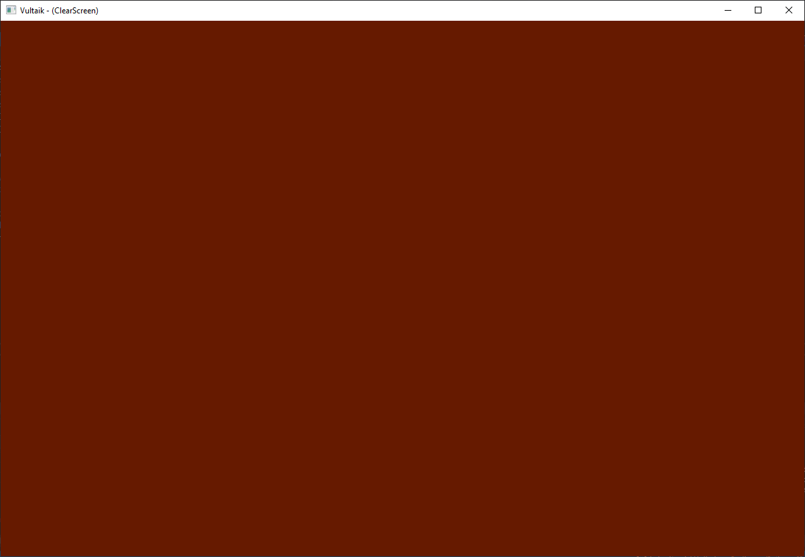
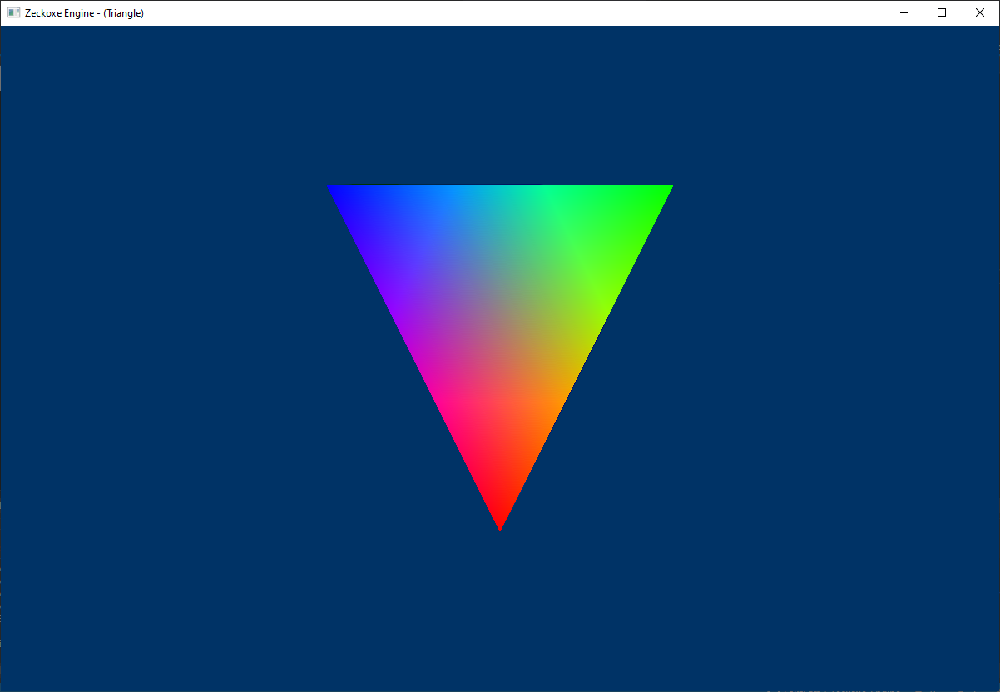
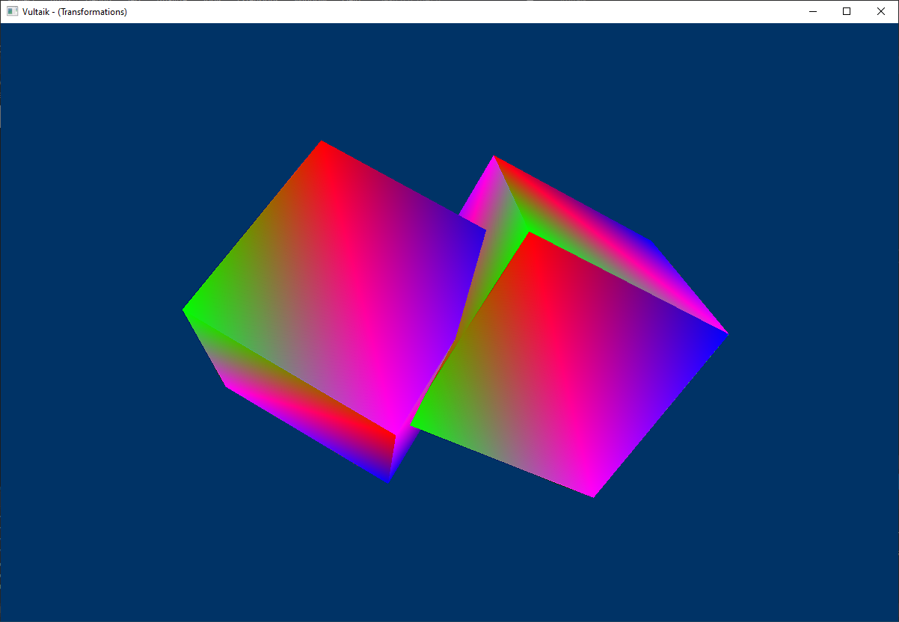
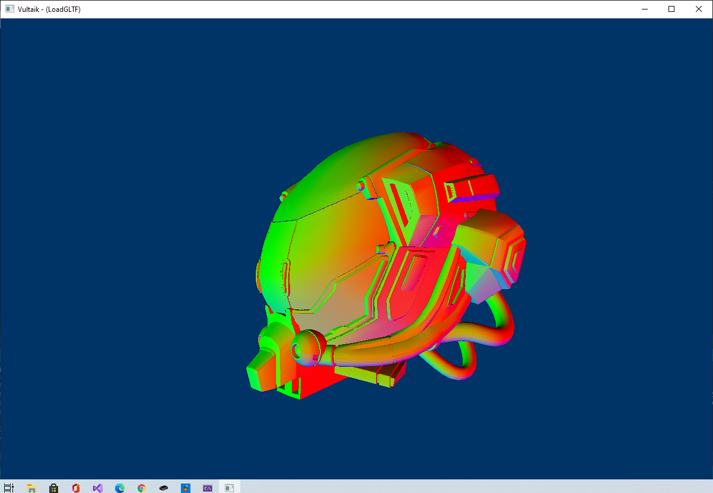
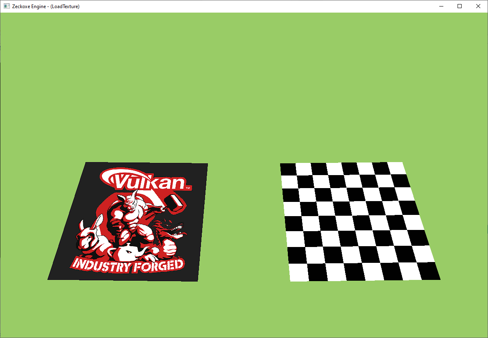
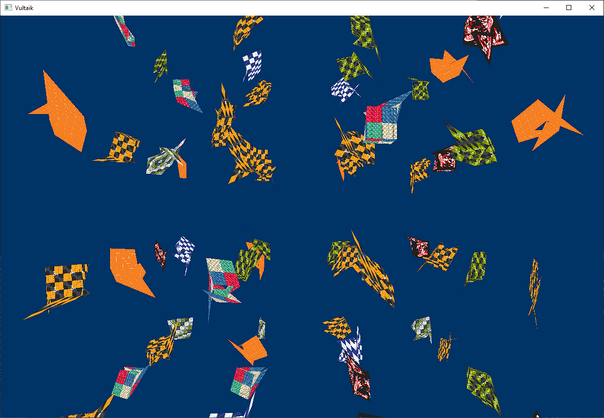
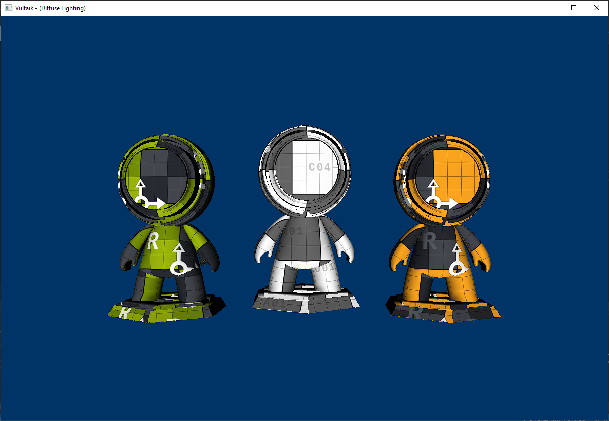
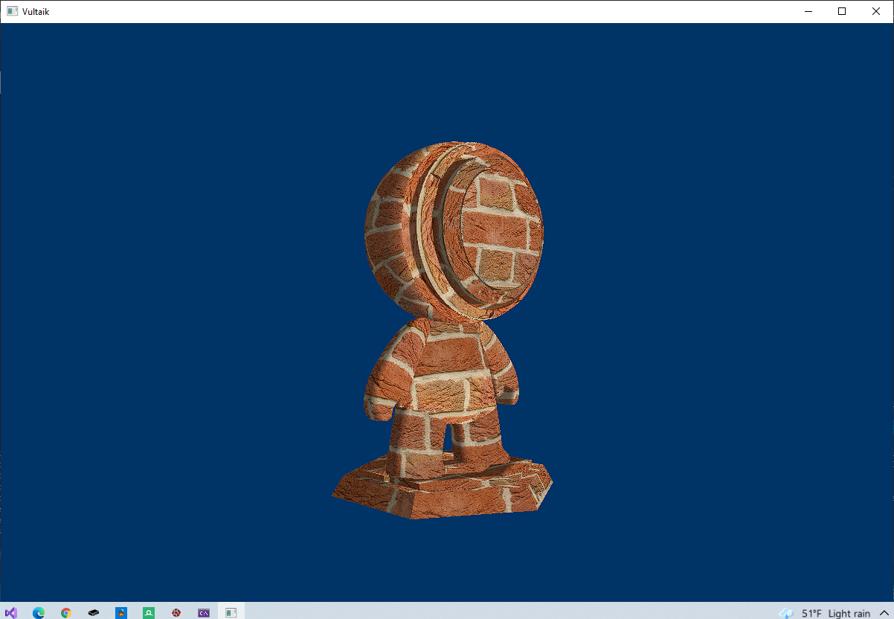
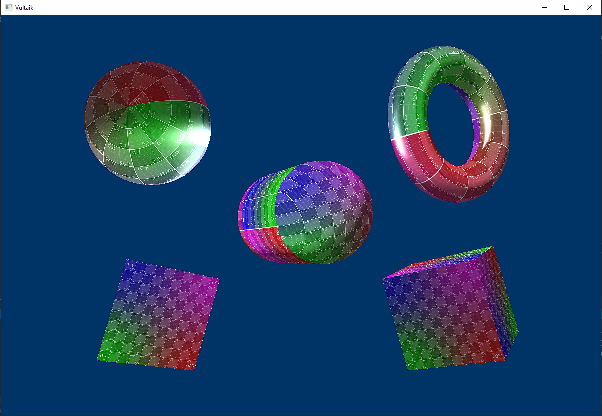

<h1 align="center">
   

  
  ##               Vultaik is a 2D/3D renderer implemented in [Vulkan®](https://www.khronos.org/vulkan/)
  
</h1>

 

 

## Overview
Vultaik can be used to produce render layers for custom engines or next-gen games and provides building blocks for writing your own engine or game quickly.
Due to the parallel nature of GPUs, Vultaik can use [GPGPU](https://en.wikipedia.org/wiki/General-purpose_computing_on_graphics_processing_units) to exploit a GPU for computational tasks. Supports ComputePipeline and more, allowing to be used for general computations

 

## Low-level rendering backend

The rendering backend focuses entirely on Vulkan and HLSL, however, the API greatly simplifies the more painful points of writing straight Vulkan. Modern Vulkan [extensions](https://github.com/FaberSanZ/Vultaik/wiki/Extension) and [features](#Features) are aggressively made use of to improve performance

Some notable extensions that **should** be supported for optimal or correct behavior.
These extensions will likely become mandatory later.

- `VK_EXT_descriptor_indexing`
- `VK_KHR_timeline_semaphore`

 

## Features:

- [ ] Ray Tracing
- [ ] Conservative rasterization
- [ ] Multiview rendering
- [ ] Conditional rendering 
- [ ] Shading rate
- [x] Descriptor indexing
- [ ] Timeline semaphore
- [ ] Synchronization2
- [x] Memory allocator
- [x] GPU-Assisted Validation
- [x] Compute Shader
- [x] Geometry Shader
- [x] Tessellation Shader
- [ ] Instancing, Indirect drawing
- [ ] Post-AA (FXAA, SMAA and TAA)
- [ ] Multithreaded rendering
- [x] Automatic descriptor set management
- [x] Shader reflection with [SPIRV-Cross](https://github.com/KhronosGroup/SPIRV-Cross)
- [x] Vulkan HLSL for shaders, shaders are compiled in runtime with [DirectXShaderCompiler](https://github.com/microsoft/DirectXShaderCompiler)
- [x] GLTF 2.0 for samples

 

> The examples not only show how to use the API, but also show things specific to HLSL and its mapping with Vultaik, (Variable Rate Shading, [AMD effects](https://gpuopen.com/effects/), Ray Tracing) and can be used as a guide on how to use techniques independent of Vulkan.

## Examples

Example | Details
---------|--------
 | [Clear Screen](Src/Samples/Samples/ClearScreen/ClearScreen.cs)  This example shows how to configure the device and clear the color.
 | [Triangle](Src/Samples/Samples/Triangle/Triangle.cs)  This example shows how to render simple triangle.
 | [Transformations](Src/Samples/Samples/Transformations/Transformations.cs)  This example how to transform the world space for each object.
 | [Push Constant](Src/Samples/Samples/PushConstant/PushConstant.cs)  This example use push constants, small blocks of uniform data stored within a command buffer, to pass data to a shader without the need for uniform buffers.
 | [Load GLTF](Src/Samples/Samples/LoadGLTF/LoadGLTF.cs)  This example shows how to load GLTF models.
 | [Load Texture](Src/Samples/Samples/LoadTexture/LoadTexture.cs)  This example shows how to load 2D texture from disk (including all mip levels). 
 | [Bindless](Src/Samples/Samples/Bindless/Bindless.cs)  This example demonstrates the use of VK_EXT_descriptor_indexing for creating descriptor sets with a variable size that can be dynamically indexed in a shader using `SPV_EXT_descriptor_indexing`.
 | [Diffuse Lighting](Src/Samples/Samples/Lighting/Lighting.cs)  This example shows how to create diffuse lighting. 
 | [Ambient Lighting](Src/Samples/Samples/AmbientLighting/AmbientLighting.cs)  This example shows how to create ambient lighting. 
 | [Specular Lighting](Src/Samples/Samples/SpecularLighting/SpecularLighting.cs)  This example shows how to create specular lighting. 
 | [Compute Texture](Src/Samples/Samples/SpecularLighting/ComputeTexture.cs)  Use a calculation shader in conjunction with a separate calculation queue to modify a full screen image.

 

Additionally, **Vultaik** uses NuGet packages or code from the following repositories:

- [Vortice.Vulkan](https://github.com/amerkoleci/Vortice.Vulkan)
- [Vortice.Windows](https://github.com/amerkoleci/Vortice.Windows)
- [Silk.NET](https://github.com/dotnet/Silk.NET)
- [VMASharp](https://github.com/sunkin351/VMASharp)

